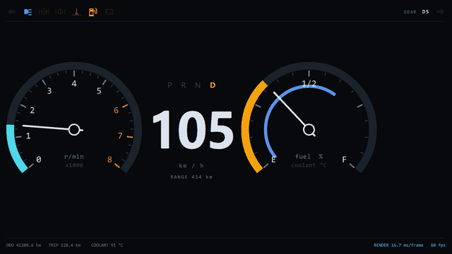
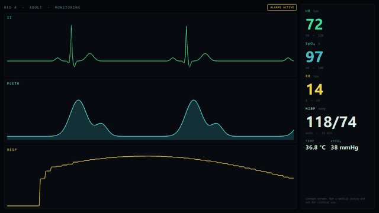
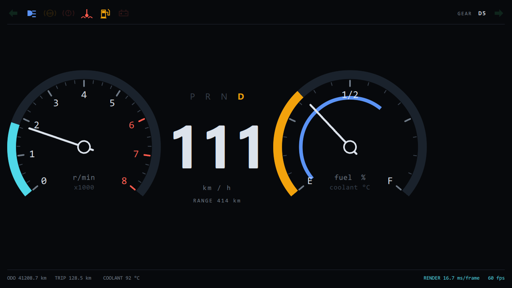
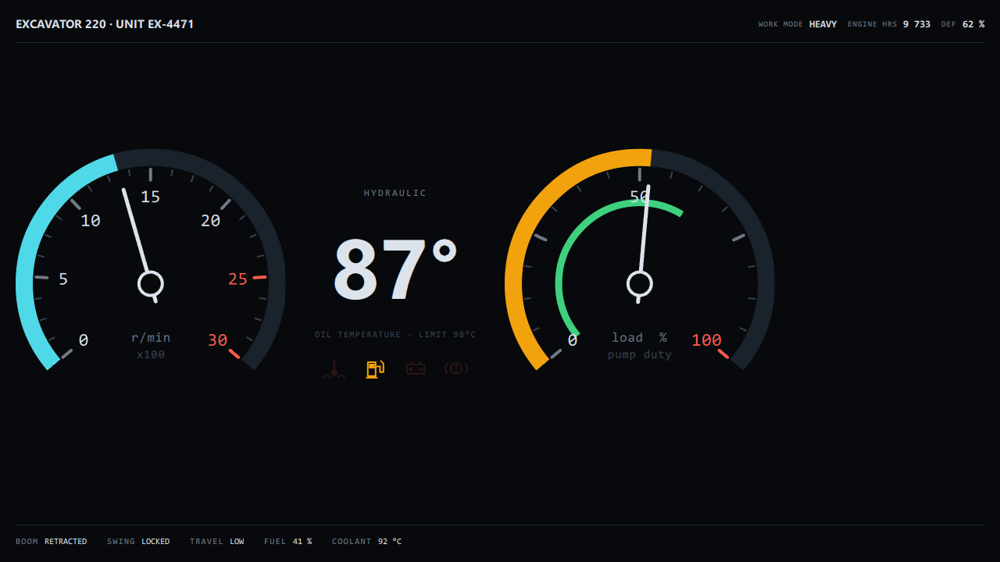
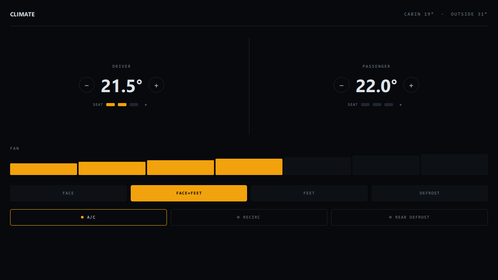
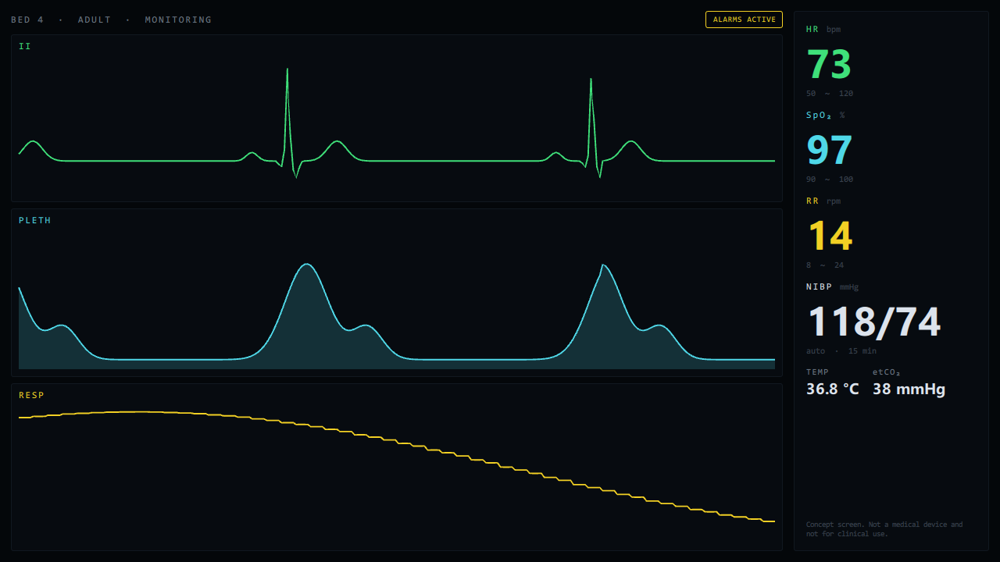
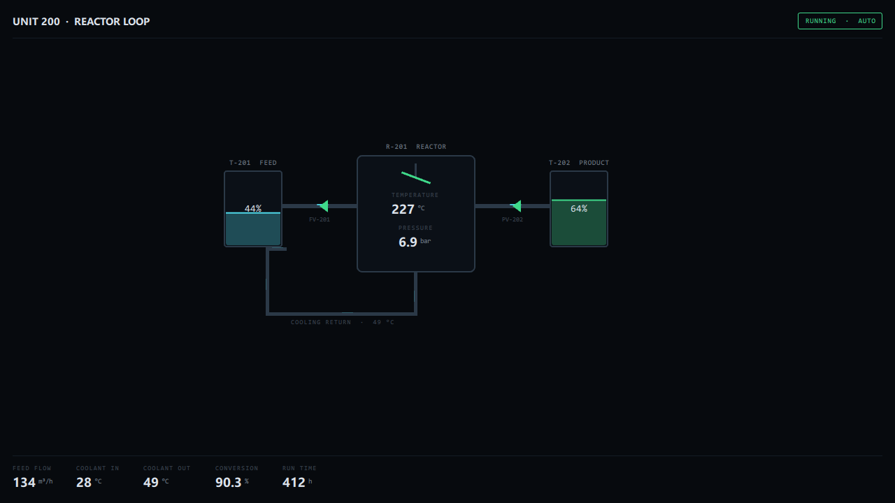
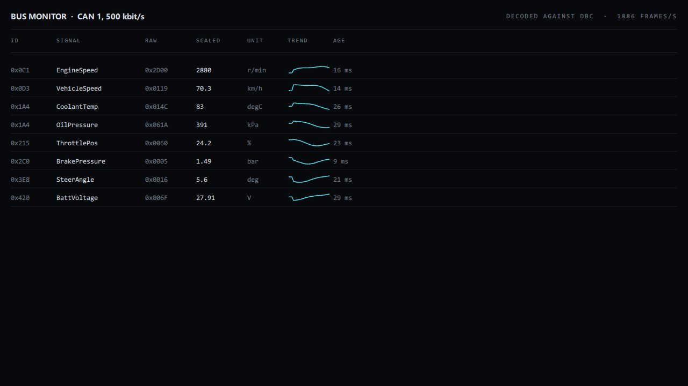
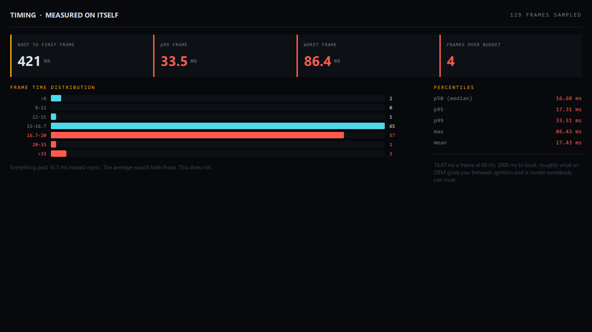

# HMI Screens

Nine Qt Quick screens across six industries, one C++ and QML codebase.
Builds for Windows, macOS, Linux and the browser.

What the same codebase looks like when each industry gets its own
conventions instead of a recoloured version of somebody else's.

## In motion

`--record` writes a frame sequence in one go.

| Instrument cluster | Patient monitor |
|---|---|
|  |  |
| Needles, telltales and gear on a 30 second drive cycle | ECG, plethysmograph and respiration sweeping live |

## The screens

| Screen | Industry | What it demonstrates |
|---|---|---|
| Cluster | Automotive | ISO 2575 telltale colours, scene-graph needles inside a 16.7 ms frame |
| Heavy | Off-highway plant | Same components, operator priorities: hydraulic temperature and load before road speed |
| Climate | In-cabin controls | Touch targets sized for a moving vehicle |
| Patient | Medical devices | ECG from a real PQRST complex, clinical colour convention, every value shown with its alarm limits |
| Spectrum | Test and measurement | Logarithmic dBm scale, 10x8 graticule, a marker that reads its value off the trace it draws |
| Plant | Process control | A mimic, not a dashboard: geometry carries the information and colour is state |
| Fleet | Telematics | `QAbstractListModel` with named roles behind a `ListView` |
| CAN bus | Diagnostics | Decoded signals with rolling history and custom scene-graph sparklines |
| Timing | All of them | The application measuring its own render loop |

### Automotive, off-highway, in-cabin

| Instrument cluster | Excavator panel | Dual zone climate |
|---|---|---|
|  |  |  |

### Medical, test and measurement, process

| Patient monitor | Spectrum analyser | Reactor mimic |
|---|---|---|
|  |  |  |

### Operator tools

| Fleet telematics | CAN bus monitor | Frame and boot timing |
|---|---|---|
|  |  |  |

`--solo` drops the tab strip so a screen gets the whole window.

## Rendering

Gauges are `QtQuick.Shapes`, so the sweep is a GPU-batched path rather
than a repainted canvas.

`SparklineItem` and `WaveTrace` are `QQuickItem`s that build their own
`QSGGeometry` in `updatePaintNode()`. Line width is expanded into a
triangle strip rather than requested as a thick GL line, because
**D3D11 ignores line width entirely** and a wide line strip renders one
pixel wide on Windows and correct everywhere else.

`WaveTrace` holds a fixed scale on purpose. Auto-scaling suits a trend
and ruins anything clinical or metrological: an ECG that rescales itself
hides the amplitude change that mattered.

## Timing

Boot to first frame is **475 ms** against the 2000 ms most automotive
programmes allow between ignition and a correct cluster.

It was 1100 ms until the TIMING screen showed it. A `StackLayout`
instantiates every child up front, so all nine screens were being built
before the first frame. Loading them on first selection instead:

| | run 1 | run 2 | run 3 |
|---|---|---|---|
| Eager | 1145 ms | 1101 ms | 1062 ms |
| On demand | 475 ms | 505 ms | 483 ms |

Cold starts, same binary, only `Loader.active` changed.

## Fonts

`src/typography.h` resolves the font against families the machine
actually has and logs its choice at startup.

This started out naming "Segoe UI" and "Consolas" in 103 places. Both are
Windows-only. It built, ran at 60 fps and looked completely fine. On a
Mac or a Linux box every one of those would have quietly swapped for
something else, with nothing in the log to tell you why.

## Build

```
build.bat                          # Windows, MSVC + Ninja
QT_PREFIX=/path/to/qt ./build.sh   # Linux / macOS
```

Requires Qt 6.5 or newer, developed against 6.8.3. WebAssembly needs the
Emscripten version Qt was built against, 3.1.56 for Qt 6.8.

## Keys

**1** to **9** select a screen. **Space** pauses the drive cycle.

```
--screen N              open on one screen
--solo                  drop the chrome so the screen fills the window
--shot out.png          capture once and exit
--record p --frames 30 --every 90    write p_000.png .. and exit
```
